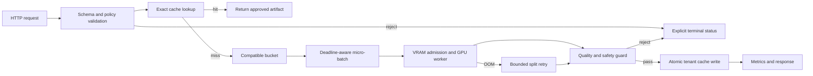

# 低成本大规模图像生成服务

这个项目接收已经冻结的基础模型和 LoRA 产物，把单机 Diffusers 推理改造成可审计的在线服务。它不重复 4.1 的训练工作，4.1 负责得到可用权重，4.2 负责把权重稳定、低成本地服务出去。

仓库当前已经实现请求校验、显存准入、兼容分桶、deadline-aware micro-batching、租户隔离的完全一致缓存、OOM 拆批、质量门禁后的缓存写入、成本统计、异步 HTTP 聚合网关和确定性压测模拟。真实 Diffusers 后端也有独立适配层，但本地没有执行 GPU 推理，所以没有吞吐、延迟、显存、质量或成本实测结论。

## 1. 项目边界

业务目标不是“单张图最快”，而是在固定硬件、固定请求分布和固定质量门槛下，提高每 GPU 小时交付的合格图片数。服务同时约束三个方向：

- 质量：只有通过质量与安全门禁的输出才进入有效吞吐分母并允许写缓存。
- 时延：batch 等待不能超过请求 deadline，冷门 shape 不能一直等待热门请求。
- 成本：GPU 失败尝试、OOM 重试和预热开销都要计入，不只统计成功 batch。

参考目标写在 `project.json`，状态全部是 `not_measured`。在真实 GPU 压测完成前，不能把 `1.6x`、`0.1%` 或 `95%` 写成项目成绩。

## 2. 请求生命周期



入口先验证模型和 adapter revision、尺寸、步数、deadline 与租户策略。缓存未命中后，请求按兼容键进入短窗口队列。执行失败时只在预算内拆 batch；单请求仍 OOM 就返回明确失败，不能无限重试。

## 3. 为什么 batch 不能只看“都用 SDXL”

Diffusers 的 pipeline 调用通常要求 batch 内共享尺寸、步数、scheduler、guidance 和当前 adapter 集合。`torch.compile` 还会对 shape 和控制流做特化。项目的 `compatibility_key()` 因此包含：

- 基础模型 ID、固定 revision 和 dtype；
- width、height、steps、scheduler、guidance scale 与输出格式；
- 每个 LoRA 的 ID、revision、文件 SHA-256 和 scale。

prompt、negative prompt 和 seed 可以逐样本变化，不阻止合批。模型或 adapter 版本不同的请求绝不会进入同一个 batch。`max_batch_work_units` 再按 `megapixels * steps` 限制总工作量，避免“batch size 相同，但显存和计算完全不同”。

核心实现位于 `src/image_service/batching.py`：

```python
def compatibility_key(request: GenerationRequest) -> tuple[object, ...]:
    adapters = tuple((a.adapter_id, a.revision, a.artifact_sha256, a.scale) for a in request.adapters)
    return (
        request.model_id,
        request.model_revision,
        request.dtype,
        request.width,
        request.height,
        request.steps,
        request.scheduler,
        request.guidance_scale,
        request.output_format,
        adapters,
    )
```

## 4. 请求合同、幂等和缓存

`GenerationRequest` 不接受浮动的业务上下文。每个请求必须带 tenant、模型 revision、adapter 哈希、seed、策略版本和 deadline。相同 seed 只有在权重、scheduler、输入和运行配置也固定时才有复现意义。

缓存键只覆盖会改变生成结果或隔离边界的字段，不包含 `request_id`、`idempotency_key`、提交时间和 deadline。这样同一租户的传输重试能命中已有结果，模型 revision、策略版本或 adapter 文件发生变化则自然得到新键。缓存值按 tenant 分目录，二进制和元数据使用临时文件加 `os.replace()` 原子提交。

语义缓存没有纳入主链路。图像生成里的“意思相近”不等于“用户接受同一张图”，错误命中还可能跨越版权、品牌或审核边界。需要近似复用时，应作为单独产品能力设计并取得用户授权。

## 5. 显存准入和 OOM 降级

`AdmissionController` 在入队前检查允许的模型、尺寸、像素数、步数、adapter 数量、队列深度和估算峰值显存。估算公式是保守容量模型，不是假装精确预测 CUDA allocator：

```text
estimated_peak_mb = model_resident_mb
                  + activation_mb_per_megapixel * megapixels * batch_size
                  + adapter_mb_each * adapter_count
                  + headroom_mb
```

系数需要用目标 GPU 的实测峰值回填。在线 OOM 仍可能发生，因此服务记录失败 batch 的 GPU 时间，再按二分法拆 batch。重试次数由 `oom_split_retries` 限制；失败尝试照常进入成本分子。

CPU/model offload、VAE slicing 和 VAE tiling 不是默认“加速开关”：

- VAE slicing 适合多图解码，主要降低 batch 解码峰值显存。
- VAE tiling 适合高分辨率，可能带来分块色调差异，需要图像回归。
- model CPU offload 能降低显存，但增加 PCIe 传输，必须和常驻 GPU 基线分开测。
- sequential CPU offload 更省显存但通常更慢，不放进默认配置。

## 6. 编译、attention 和动态 LoRA

PyTorch 2.x 下 Diffusers 默认可以使用 SDPA。额外 attention backend、`torch.compile`、channels-last 和量化都应逐项消融。当前参考配置把 `compile_unet` 关掉，因为主服务允许动态 LoRA。

编译 worker 和动态 adapter worker应分池：固定 shape、固定模型、固定 adapter 的流量适合编译；动态 LoRA 可能触发加载、删除或重新编译。参考后端直接拒绝 `compile_unet=true` 与 `lora_mode=dynamic` 的组合，避免表面启动成功、线上却反复编译。

真实后端在 `src/image_service/diffusers_backend.py`，执行时会：

1. 使用固定模型 revision 加载 SDXL pipeline；
2. 根据配置选择 VAE slicing、tiling 或 model CPU offload；
3. 从本地批准目录加载 LoRA，并核对文件 SHA-256；
4. 只执行兼容 batch，为每个请求建立独立 `torch.Generator`；
5. CUDA OOM 转成控制面可识别的 `BackendOOM`，交给有界拆批处理。

## 7. 运行本地控制面

下面的命令不下载模型，也不需要 GPU。

```powershell
$python = "C:\Users\Administrator\.cache\codex-runtimes\codex-primary-runtime\dependencies\python\python.exe"
& $python -B -X utf8 scripts\validate_config.py
& $python -B -X utf8 scripts\validate_requests.py
& $python -B -X utf8 -m unittest discover -s tests -v
& $python -B -X utf8 scripts\load_test.py --output artifacts\reports\simulation.json
```

`load_test.py` 使用确定性的 `FakeBackend` 验证 cache、batch、deadline、OOM 拆分和成本口径。输出会明确标记 `simulated_not_gpu_measured`，不能放进简历结果。

如果只想检查 HTTP 合批链路，安装 `fastapi` 和 `uvicorn` 后启动 fake backend：

```powershell
python scripts\serve.py --backend fake --host 127.0.0.1 --port 8000
```

接口包括：

- `GET /healthz`：进程和 backend 状态；
- `GET /metrics/snapshot`：当前请求、batch 尝试、OOM、缓存和成本统计；
- `POST /v1/images/generate`：提交完整 `GenerationRequest`。

生产环境不要在响应里传 base64 大图。参考接口为本地演示保留简单返回，真实部署应把审核通过的图片写入对象存储，响应只返回短期签名 URL 和内容哈希。

## 8. 执行真实 GPU 基线

先把 `configs/service.json` 中的 `model_revision` 换成明确 commit SHA，并把 LoRA 放入本地批准目录。adapter catalog 的键必须是 `(adapter_id, revision)`，值是 `.safetensors` 文件路径。不要把 Hugging Face 的浮动 `main` 当作可复现实验版本。

真实压测至少包含：

- B0：batch=1，cache/compile/offload 全关；
- B1：只开兼容 micro-batching；
- B2：在 B1 上开完全一致缓存；
- B3：固定 shape、固定 adapter 的编译 worker；
- B4/B5：分别测试 VAE slicing 和 tiling；
- B6：单独测试 model CPU offload。

完整矩阵、日志字段和口径见 `docs/benchmark_protocol.md`。发布容量报告前，`scripts/capacity_report.py` 会拒绝 `result_status != measured` 的报告，除非显式传 `--allow-simulated` 做调试。

```powershell
python scripts\capacity_report.py artifacts\reports\gpu-measured.json `
  --utilization-target 0.70 `
  --gpu-hour-price 3.80
```

## 9. 指标和成本口径

核心指标是 `accepted_images_per_gpu_hour`，不是裸 QPS。一个 512x512、20 steps 请求和一个 1536x1536、50 steps 请求不能按同一单位解释。

| 指标 | 统计口径 | 用途 |
|---|---|---|
| accepted images/GPU-hour | 质量门禁通过数 / 聚合 GPU 小时 | 主吞吐指标 |
| E2E P50/P95/P99 | 接收至最终状态 | 用户体验与 SLO |
| queue wait P95 | 接收至 batch 开始 | 判断是否过度等 batch |
| OOM attempt rate | OOM batch 尝试 / 全部 batch 尝试 | 容量模型是否保守 |
| exact cache hit rate | 完全一致命中 / 全部请求 | 真实复用比例 |
| quality guard pass rate | 通过 / 已生成并检查 | 防止吞吐挤压质量 |
| GPU cost/accepted image | 全部尝试 GPU 成本 / 通过数 | 业务成本 |

如果 GPU 是按实例墙钟时间计费，还要把空闲、预热和发布重叠时间计入账单口径；只用 CUDA kernel 时间会低估实际成本。

## 10. 测试覆盖

CPU 单元测试覆盖以下风险：

- request ID 和传输幂等键变化不改变生成缓存键，seed 或 revision 变化一定改变；
- 不同 shape 或模型 revision 绝不会合批；
- batch work budget 和 deadline 生效；
- 超尺寸请求在入队前被拒绝；
- exact cache hit 不再调用 backend；
- 大 batch OOM 后按预算拆分，失败尝试进入成本；
- 质量门禁拒绝的输出不写缓存；
- capacity 只使用合格输出，并使用全部 GPU 尝试时间；
- 检入配置始终明确标记 `not_measured`。

## 11. 面试时怎么讲

先讲矛盾：batch 能提高 GPU 利用率，却会增加排队延迟，还可能因 shape、steps 或 adapter 不兼容导致显存失控。然后讲你的控制面：请求合同让版本和成本可追踪，compatibility key 保证合批正确，短窗口 scheduler 控制尾延迟，显存准入加有界拆批处理 OOM，质量门禁决定什么才算有效吞吐。

容易被追问的点：

- 为什么不只报 QPS？因为请求计算量和质量通过率不同，裸 QPS 可以被小图、低 steps 和拒绝输出“做高”。
- 为什么缓存键必须有 adapter SHA-256？revision 名称可能被覆盖，文件哈希才能绑定实际权重。
- 为什么 `torch.compile` 不和动态 LoRA 默认同时开？shape 或 adapter target/rank 变化可能触发重新编译，冷启动会污染尾延迟和成本。
- 为什么 OOM 率按 batch 尝试算？一次失败 batch 会消耗 GPU 时间并影响多条请求，只看最终请求失败会掩盖重试成本。
- 为什么不用语义缓存？创意生成的近似命中很难保证用户意图、版权和审核语义一致。

## 12. 简历表达

未完成 GPU 压测时只能写实现范围：

> 实现多租户 Diffusers 图像生成服务控制面，覆盖版本化请求合同、兼容 micro-batching、显存准入、租户隔离 exact cache、OOM 有界拆批和有效图片成本统计；使用 CPU 单测与确定性 backend 验证调度闭环，GPU 性能与质量指标待固定硬件实测。

拿到可复现报告后，再把实测硬件、请求分布、基线、提升和质量约束替换进去。不要保留“参考目标”几个字后直接冒充成绩。

## 13. 目录

```text
06-low-cost-image-service/
├── configs/                  # 服务和负载配置，默认 not_measured
├── data/sample/              # 完整请求样例
├── docs/                     # GPU 压测协议和故障手册
├── scripts/                  # 配置校验、模拟压测、容量报告、HTTP 服务
├── src/image_service/        # 请求、调度、准入、缓存、指标和 backend
├── tests/                    # 无 GPU 可运行的核心测试
├── project.json              # 项目边界与验收目标
└── requirements-service.txt  # HTTP 和真实 GPU backend 的可选依赖
```

## 14. 官方资料

- [Diffusers: Accelerate inference](https://huggingface.co/docs/diffusers/optimization/fp16)：dtype、SDPA、`torch.compile`、shape 变化导致重新编译。
- [Diffusers: Reduce memory usage](https://huggingface.co/docs/diffusers/optimization/memory)：VAE slicing/tiling、device placement 和各类 CPU offload 的取舍。
- [Diffusers: Load adapters](https://huggingface.co/docs/diffusers/main/using-diffusers/loading_adapters)：LoRA 加载、hotswap 与 compiled model 的限制。
- [PyTorch: torch.compile](https://docs.pytorch.org/docs/stable/generated/torch.compile.html)：`dynamic`、`fullgraph`、backend 和编译语义。
- [NVIDIA Triton: Batchers](https://docs.nvidia.com/deeplearning/triton-inference-server/user-guide/docs/user_guide/batcher.html)：动态 batch 的最大 batch、排队延迟、优先级和 timeout 调参方法。
